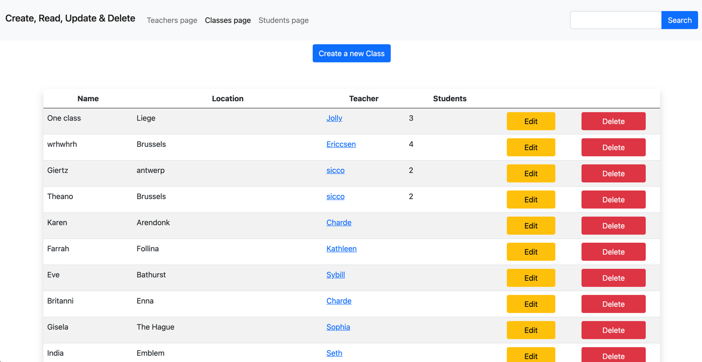
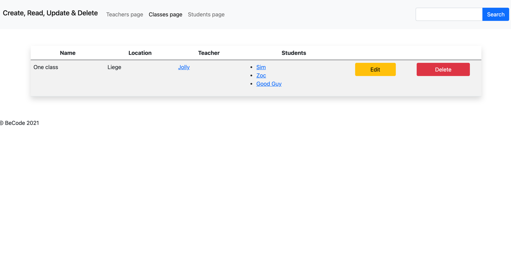
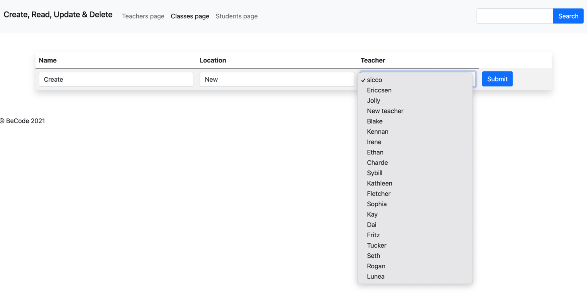

# Create, Read, Update, Delete

First assignment with the CRUD system. 

## Learning objectives
- To be able to connect to a database
- To be able to write a simple Create, Read, Update & Delete (CRUD) application
- Use a provided MVC structure to work into.

## The Mission
Create a CRUD system to store student, teacher and class information in the database. Using MVC structure.

## Must-have features
You have to provide the following pages for Students, Teacher & Class.

- [x] A general overview of all records of that entity in a table
    * Each row should have a button to edit or delete the entity
    * This page should have a "create new" button
- [x] A detailed overview of the selected entity
    * [x] This should include a button to delete this entity
    * [x] Edge case: A teacher cannot be removed if he is still assigned to a class
    * [x] Edge case: If you remove a class, make sure to remove the link between the students and the class.
- [x] A page to edit an existing entity
- [x] A page to create a new entity

### Fields:
On the general overview table you can yourself decide what would be useful information to show.

On the detailed overview you have to provide the following information:

#### Student
- [x] Name
- [x] Email
- [x] Class (with clickable link)
- [x] Assigned teacher (clickable link - relation via class)

#### Teacher
- [x] Name
- [x] Email
- [x] List of all students currently assigned to him (clickable link)
 
#### Class 
- [x] Name class (Giertz, Lamarr, ...)
- [x] Location (Antwerp, Gent, Genk, Brussels, Liege)
- [x] Assigned teacher (clickable link)
- [x] List of assigned students (clickable link)

***

## Nice to have features
- [x] Add a search bar at the top of each page to search for the names of teachers or students
- Make an address entity. An address can be assigned to a student or teacher (where he lives) or to a class (where are the lessons given).
- Add [Basic HTTP Authentication](https://www.lifewire.com/password-protect-single-file-with-htaccess-3467922) with a `.htaccess` file.

# trying to fix:

- [ ] ability to load students with empty fk-s
- [ ] logical issues (can't add class without a teacher etc)

***

## Looks

#### default view

#### detailed view

#### creating form look *(could have found a better name...)*

